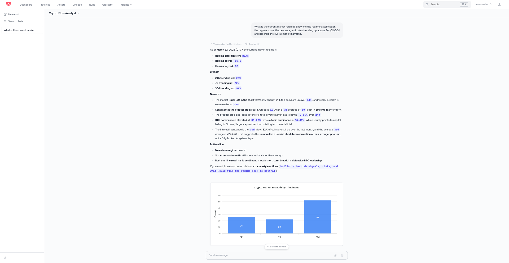
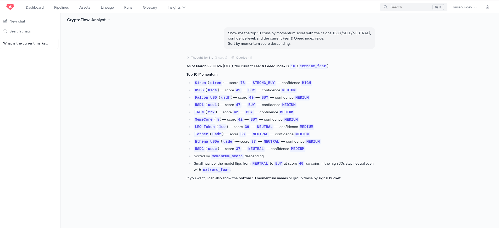
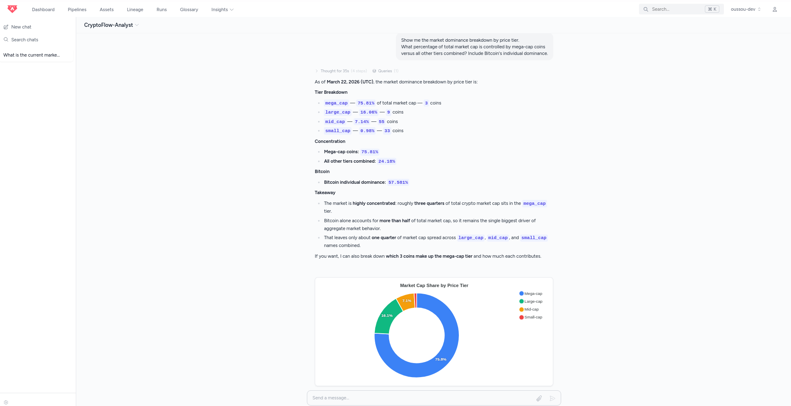
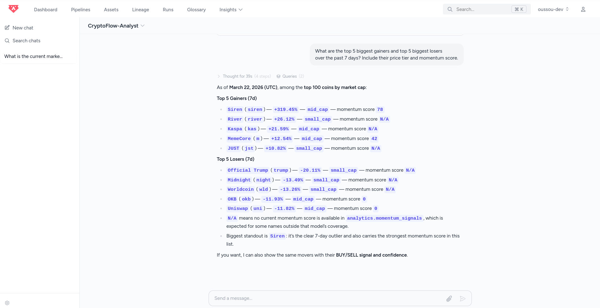
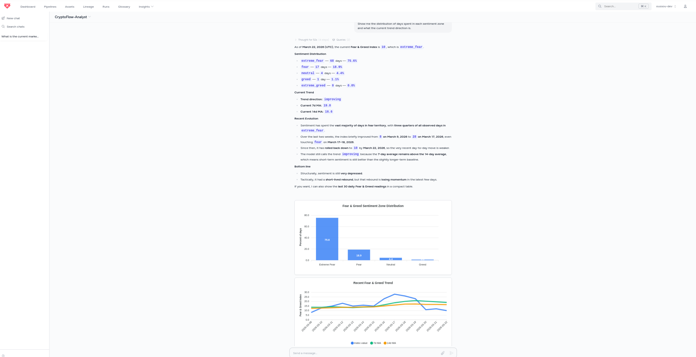

# 🚀 CryptoFlow Analytics

**Real-time Cryptocurrency Market Intelligence Pipeline**

[](https://getbruin.com)
[](https://www.coingecko.com/en/api)
[](https://cloud.google.com/bigquery)
[](LICENSE)

> An end-to-end data pipeline that ingests multi-source crypto data, transforms it through a medallion architecture, and produces actionable market intelligence — including a **Market Regime Detector**, **Composite Momentum Signals**, and **Sentiment Analysis** — all orchestrated by [Bruin](https://getbruin.com).

---

## 📋 Table of Contents

- [Problem Statement](#-problem-statement)
- [Architecture](#-architecture)
- [Data Sources](#-data-sources)
- [Pipeline Layers](#-pipeline-layers)
- [Key Analytics](#-key-analytics)
- [Bruin Features Used](#-bruin-features-used)
- [Quick Start](#-quick-start)
- [AI Analyst Insights](#-ai-analyst-insights)
- [Data Quality](#-data-quality)
- [Project Structure](#-project-structure)
- [Design Decisions](#-design-decisions)
- [What I Learned](#-what-i-learned)

---

## 🎯 Problem Statement

Crypto markets generate massive amounts of data across hundreds of exchanges, thousands of tokens, and multiple sentiment indicators. Individual investors and analysts face three core challenges:

1. **Data fragmentation** — Prices, volumes, sentiment, and trending data live in separate APIs with different formats
2. **Signal noise** — Raw price changes alone are misleading without context (volume confirmation, market breadth, sentiment)
3. **Regime blindness** — Most dashboards show what happened, but fail to classify *where we are* in the market cycle

**CryptoFlow Analytics** solves this by building a unified intelligence layer that ingests, cleans, enriches, and analyzes crypto data to produce **actionable signals** — not just charts.

---

## 🏗 Architecture

```
┌─────────────────────────────────────────────────────────────────────┐
│                        EXTERNAL SOURCES                             │
│  CoinGecko API (Free)  │  Fear & Greed API  │  CSV Seeds (static)   │
└───────────┬─────────────────────┬─────────────────────┬─────────────┘
            │                     │                     │
            ▼                     ▼                     ▼
┌─────────────────────────────────────────────────────────────────────┐
│  🥉 BRONZE — Ingestion (raw.)                                       │
│  ┌──────────────────┐ ┌──────────────────┐ ┌─────────────────────┐  │
│  │ fetch_coin_markets│ │ fetch_fear_greed │ │ fetch_global_data   │  │
│  │ (Python asset)   │ │ (Python asset)   │ │ (Python asset)      │  │
│  └──────────────────┘ └──────────────────┘ └─────────────────────┘  │
│  ┌──────────────────┐ ┌──────────────────────────────────────────┐   │
│  │ fetch_trending   │ │ fetch_coin_categories                    │   │
│  │ (Python asset)   │ │ (Python asset — reads seeds/categories)  │   │
│  └──────────────────┘ └──────────────────────────────────────────┘   │
└───────────────────────────────┬─────────────────────────────────────┘
                                │
                                ▼
┌─────────────────────────────────────────────────────────────────────┐
│  🥈 SILVER — Staging (stg.)                                         │
│  ┌──────────────────┐ ┌────────────────────┐ ┌───────────────────┐  │
│  │ stg_enriched_    │ │ stg_fear_greed_    │ │ stg_global_       │  │
│  │ coins            │ │ daily              │ │ metrics           │  │
│  │ + market cap tier│ │ + moving averages  │ │ + dominance calc  │  │
│  │ + liquidity ratio│ │ + trend direction  │ │ + volume ratio    │  │
│  │ + supply scarcity│ │ + sentiment zones  │ │                   │  │
│  └──────────────────┘ └────────────────────┘ └───────────────────┘  │
└───────────────────────────────┬─────────────────────────────────────┘
                                │
                                ▼
┌─────────────────────────────────────────────────────────────────────┐
│  🥇 GOLD — Analytics (analytics.)                                   │
│  ┌──────────────────┐ ┌──────────────────┐ ┌─────────────────────┐  │
│  │ market_dominance │ │ momentum_signals │ │ market_regime       │  │
│  │ BTC/ETH/Alt share│ │ Composite score  │ │ Bull/Bear/Neutral   │  │
│  └──────────────────┘ │ BUY/SELL signals │ │ Breadth + Sentiment │  │
│  ┌──────────────────┐ └──────────────────┘ └─────────────────────┘  │
│  │ volatility_      │ ┌──────────────────┐ ┌─────────────────────┐  │
│  │ analysis         │ │ top_performers   │ │ fear_greed_impact   │  │
│  │ Volatility tiers │ │ Gainers & Losers │ │ Sentiment zones     │  │
│  └──────────────────┘ └──────────────────┘ └─────────────────────┘  │
└─────────────────────────────────────────────────────────────────────┘
                                │
                                ▼
                    ┌───────────────────────┐
                    │  🤖 Bruin AI Analyst  │
                    │  Natural language Q&A │
                    │  on all analytics     │
                    └───────────────────────┘
```

---

## 📊 Data Sources

| Source             | Type        | Endpoint               | Frequency | Cost                |
| ------------------ | ----------- | ---------------------- | --------- | ------------------- |
| **CoinGecko**      | REST API    | `/coins/markets`       | Daily     | Free (30 calls/min) |
| **CoinGecko**      | REST API    | `/global`              | Daily     | Free                |
| **CoinGecko**      | REST API    | `/search/trending`     | Daily     | Free                |
| **Alternative.me** | REST API    | `/fng/` (Fear & Greed) | Daily     | Free, no key        |
| **CSV Seed**       | Static file | `coin_categories.csv`  | Manual    | —                   |

---

## 🔄 Pipeline Layers

### 🥉 Bronze — Raw Ingestion

Raw data from external APIs, loaded as-is into BigQuery with an `ingested_at` timestamp. Python assets handle API calls, pagination, error handling, and return `pandas.DataFrame` objects that Bruin materializes as tables.

### 🥈 Silver — Staging

Cleaned, typed, deduplicated data with computed enrichments:

- **Market cap tiers**: mega_cap (>$100B), large_cap, mid_cap, small_cap, micro_cap
- **Liquidity ratio**: 24h volume / market cap
- **Supply scarcity**: circulating / max supply percentage
- **Intraday spread**: (high - low) / low as volatility proxy
- **Sentiment moving averages**: 7-day and 14-day smoothed Fear & Greed
- **Trend direction**: MA crossover detection (improving / deteriorating / flat)

### 🥇 Gold — Analytics

Business-ready analytical tables answering specific questions:

| Table                 | Question It Answers                                         |
| --------------------- | ----------------------------------------------------------- |
| `market_dominance`    | How is market share distributed across coins and tiers?     |
| `volatility_analysis` | Which coins are most/least volatile and why?                |
| `momentum_signals`    | Which coins show strong buying or selling momentum?         |
| `fear_greed_impact`   | How does sentiment distribute and what's the current trend? |
| `top_performers`      | Who are the biggest winners and losers across timeframes?   |
| `market_regime`       | Are we in a Bull, Bear, or Neutral market right now?        |

---

## 🧠 Key Analytics

### Market Regime Detector

The crown jewel of this pipeline. Combines three dimensions into a single regime classification:

1. **Market Breadth** (60% weight) — Percentage of top 50 coins in positive territory across 24h, 7d, and 30d timeframes
2. **Sentiment** (20% weight) — Fear & Greed Index mapped to a directional score
3. **Global Metrics** (20% weight) — Total market cap change and volume ratios

Output: `STRONG_BULL` | `BULL` | `NEUTRAL` | `BEAR` | `STRONG_BEAR` with a numeric score and human-readable narrative.

### Composite Momentum Score

A proprietary indicator combining 5 factors for each coin:

- Short-term price action (24h change)
- Medium-term trend (7d change)
- Long-term trend (30d change)
- Volume confirmation (volume/market cap ratio)
- ATH proximity (distance from all-time high)

Each factor contributes to a score from roughly -50 to +100, which is then combined with market sentiment to produce actionable signals: `STRONG_BUY`, `BUY`, `NEUTRAL`, `SELL`, `STRONG_SELL`.

The contrarian twist: a high momentum score combined with extreme fear produces a `STRONG_BUY` — the classic "buy when there's blood in the streets" signal.

---

## 🛠 Bruin Features Used

| Feature               | How It's Used                                                                              |
| --------------------- | ------------------------------------------------------------------------------------------ |
| **Python Assets**     | 5 ingestion scripts fetching from CoinGecko, Alternative.me APIs, and CSV seed        |
| **SQL Assets**        | 9 BigQuery SQL transformations across staging (3) and analytics (6) layers             |
| **Seed Assets**       | CSV-based reference data for coin categories                                               |
| **Materialization**   | `table` strategy for all assets; `merge` for incremental ingestion                         |
| **Dependencies**      | Explicit `depends` declarations creating a proper DAG                                      |
| **Quality Checks**    | Built-in (`not_null`, `unique`, `positive`, `accepted_values`) on every asset              |
| **Custom Checks**     | Business logic validations (e.g., "Bitcoin must exist in data", "dominances sum to ~100%") |
| **Glossary**          | Structured business term definitions for crypto concepts                                   |
| **Pipeline Schedule** | Daily schedule via `pipeline.yml`                                                          |
| **Bruin Cloud**       | Deployment, monitoring, and AI analyst                                                     |
| **AI Data Analyst**   | Conversational analysis on all analytics tables                                            |
| **Lineage**           | Full column-level lineage via `bruin lineage`                                              |

---

## ⚡ Quick Start

### Prerequisites

- [Bruin CLI](https://getbruin.com/docs/bruin/getting-started/introduction/installation.html) installed
- Python 3.10+ with `pandas` and `requests`
- A Google Cloud project with BigQuery enabled
- A GCP Service Account with `BigQuery Data Editor` and `BigQuery Job User` roles
- (Optional) [VS Code Bruin Extension](https://marketplace.visualstudio.com/items?itemName=bruin.bruin)

### Installation

```bash
# 1. Clone the repository
git clone https://github.com/oussou-dev/cryptoflow-analytics.git
cd cryptoflow-analytics

# 2. Set up your GCP credentials
cp gcp-key.json.example gcp-key.json  # add your service account key

# 3. Create BigQuery datasets
bq mk --dataset --location=US your-project:raw
bq mk --dataset --location=US your-project:stg
bq mk --dataset --location=US your-project:analytics

# 4. Execute the full pipeline
bruin run .
```

All data is stored in BigQuery under `raw`, `stg`, and `analytics` datasets.

### Verify the results

```bash
# Check pipeline lineage
bruin lineage .

# Query via BigQuery console or bq CLI
bq query --use_legacy_sql=false \
  'SELECT regime, regime_score, regime_narrative FROM `your-project.analytics.market_regime`'

bq query --use_legacy_sql=false \
  'SELECT name, signal, momentum_score FROM `your-project.analytics.momentum_signals` ORDER BY momentum_score DESC LIMIT 10'
```

---

## 🤖 AI Analyst Insights

Deployed on **Bruin Cloud**, the AI Data Analyst answers natural language questions about the entire pipeline output — no SQL required.

### Market Regime Analysis
> *"What is the current market regime? Show me the regime classification, score, and narrative."*



### Top Momentum Signals
> *"Show me the top 10 coins by momentum score with their BUY/SELL signal and confidence level."*



### Market Dominance by Tier
> *"Show me the market dominance breakdown by price tier. What % does mega-cap control?"*



### Top Performers (7-Day)
> *"What are the top 5 biggest gainers and losers over the past 7 days?"*



### Sentiment Analysis (Fear & Greed)
> *"How has market sentiment evolved recently? Show the distribution across sentiment zones."*



---

## ✅ Data Quality

Every asset in the pipeline includes quality checks that run automatically after each execution. Failed checks block downstream assets, ensuring data integrity throughout.

### Built-in Checks

- `not_null` — No NULL values in critical columns
- `unique` — No duplicate records where uniqueness is expected
- `positive` — Prices, volumes, and market caps are positive
- `accepted_values` — Enum-like columns contain only valid values

### Custom Business Checks

- At least 50 coins ingested per run
- Bitcoin always present in the dataset
- No negative market capitalizations
- Fear & Greed values within 0-100 range
- Market dominance percentages sum to approximately 100%
- All top 50 coins have momentum signals
- Exactly one market regime row per run

---

## 📁 Project Structure

```
cryptoflow-analytics/
├── .bruin.yml                              # Project config + BigQuery connection
├── pipeline.yml                            # Daily schedule + start_date
├── glossary.yml                            # Bruin glossary with crypto terms
├── README.md
├── LICENSE
├── .gitignore
│
├── assets/
│   ├── ingestion/                          # 🥉 BRONZE — Raw data
│   │   ├── fetch_coin_markets.py           # Top 100 coins (CoinGecko)
│   │   ├── fetch_fear_greed.py             # 90d sentiment index
│   │   ├── fetch_global_data.py            # Global market metrics
│   │   ├── fetch_trending.py               # Trending coins
│   │   └── fetch_coin_categories.py        # Seed loader: reads seeds/coin_categories.csv
│   │
│   ├── staging/                            # 🥈 SILVER — Cleaned & enriched
│   │   ├── stg_enriched_coins.sql          # Tiers, ratios, spreads
│   │   ├── stg_fear_greed_daily.sql        # Moving averages, trends
│   │   └── stg_global_metrics.sql          # Dominance, volume ratios
│   │
│   └── analytics/                          # 🥇 GOLD — Business intelligence
│       ├── market_dominance.sql            # Market share analysis
│       ├── volatility_analysis.sql         # Volatility scoring
│       ├── momentum_signals.sql            # Buy/Sell signals
│       ├── fear_greed_impact.sql           # Sentiment zone analysis
│       ├── top_performers.sql              # Winners & losers
│       └── market_regime.sql              # Bull/Bear classifier
│
├── seeds/
│   └── coin_categories.csv                # DeFi, L1, L2, Meme categories (35 coins)
│
└── docs/
    └── ai_analyst_screenshots/            # Bruin AI analyst evidence
```

---

## 🧩 Design Decisions

### Why Bruin over dbt + Airflow + Great Expectations?

| Concern             | Traditional Stack                                             | Bruin                                          |
| ------------------- | ------------------------------------------------------------- | ---------------------------------------------- |
| **Ingestion**       | Airbyte / custom scripts + separate orchestration             | Python assets with built-in materialization    |
| **Transformation**  | dbt (separate project, profiles.yml, dbt_project.yml)         | SQL assets in the same project                 |
| **Orchestration**   | Airflow DAGs (Python boilerplate, scheduler infra)            | `pipeline.yml` with schedule + `depends`       |
| **Quality**         | Great Expectations (separate YAML suites, checkpoint configs) | Inline `columns.checks` + `custom_checks`      |
| **Setup time**      | Hours to days (Docker, Airflow webserver, dbt profiles...)    | 3 commands, < 5 minutes                        |
| **Files to manage** | 10+ config files across tools                                 | 2 config files (`.bruin.yml` + `pipeline.yml`) |

The biggest win: **quality checks are embedded in the asset definition**, not in a separate tool. This means every change to a transformation automatically includes its quality contract. There's no "forgetting to update the test file."

### Why BigQuery?

- Serverless, fully managed — zero infrastructure to maintain
- Scales from kilobytes to petabytes with the same SQL
- Native integration with Bruin Cloud for seamless deployment
- Production-grade analytics with familiar SQL syntax
- Free tier covers well beyond hackathon data volumes

### Why CoinGecko Free API?

- 30 calls/minute, 10,000/month — more than enough for daily batch
- No credit card required
- Richest free-tier data: prices, volumes, market cap, ATH, supply metrics
- Well-documented, stable endpoints

---

## 💡 What I Learned

1. **Bruin's single-file asset model is powerful** — Having the SQL query, its dependencies, materialization strategy, column metadata, and quality checks all in one file eliminates an entire category of "where is the config for this?" problems.

2. **Quality checks as first-class citizens change behavior** — When checks are blocking by default, you think about data correctness *while writing the transformation*, not as an afterthought.

3. **The glossary feature is underrated** — Defining business terms in `glossary.yml` forced me to think precisely about what "market dominance" or "momentum score" means before writing SQL. That clarity propagated into better queries.

4. **Python + SQL in the same pipeline is the right abstraction** — API ingestion naturally belongs in Python. Analytical transformations naturally belong in SQL. Bruin lets both coexist without fighting about which language "wins."

---

## 📜 License

MIT — see [LICENSE](LICENSE) for details.

---

*Built for the [Data Engineering Zoomcamp 2026](https://github.com/DataTalksClub/data-engineering-zoomcamp) Project Competition, sponsored by [Bruin](https://getbruin.com).*